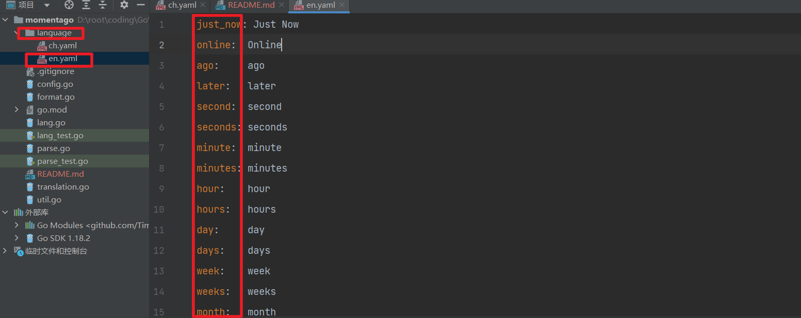

# memontago

#### 介绍

**该软件是go的一个time库**，可以实现对于时间的解析，能够处理三种形式的时间：
1. time.Time
2. Unix时间戳（timestamp）
3. 字符串格式的时间 2006-01-02 15:04:05 [+ 时区]

能够支持任意语言,可以插件式的自主添加语言，不用更改任何代码
以支持的语言：
1. Chinese
2. English
- 解析时间，判断给定的一个时间是当前时间的关系

#### 软件架构
  1. memontago.SetConfig() 
  2. memontago.Parse()
#### 安装教程
> go get github.com/Tim3Triver/memontago

#### 使用说明
 第一步：配置语言，时区，是否需要特殊标识
```go
type Config struct {
	Language string // 语言
	Location string // 时区 只在解析字符串格式表示的时间时起作用
	Special  bool   //是否支持特殊标志
}
```
> 如果不配置，则默认英文，本地时区，不支持特殊标志
> 
> 如果使用标识，则小于等于5秒则以Online显示，大于5秒 小于等于30秒以JustNow显示，而不会显示解析出来的时间差
>

第二步：func Parse(datetime interface{}) (string, error) {

datetime：输入以上三种格式的时间，进行解析。
## 扩展新的显示语言
 如果想加入新的语言可以在language目录下添加yaml格式配置文件，使用的时候在配置文件中指定相应的文件名（不带后缀：`.yaml`）作为Config中的Language的值

例如：
1.添加配置项 

2.SetConfig(Config{ Language : "en" }) 